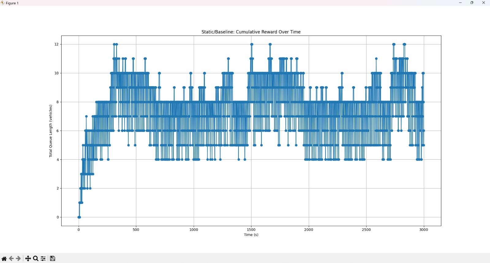
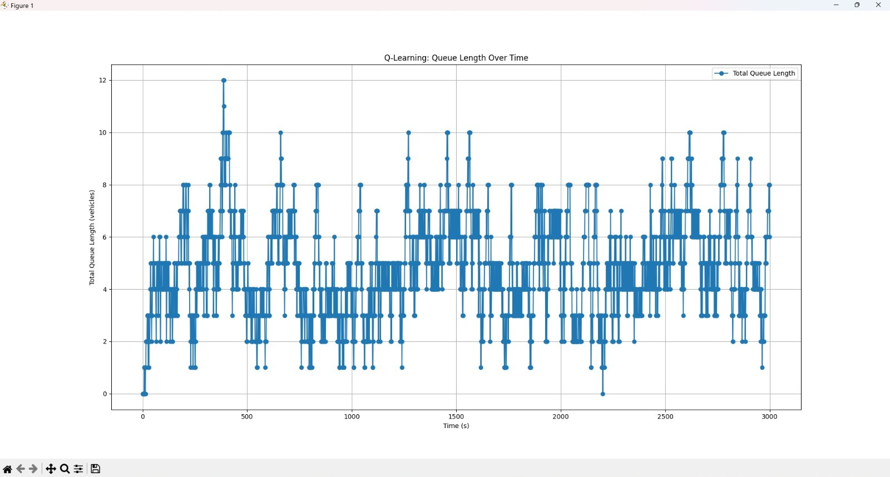
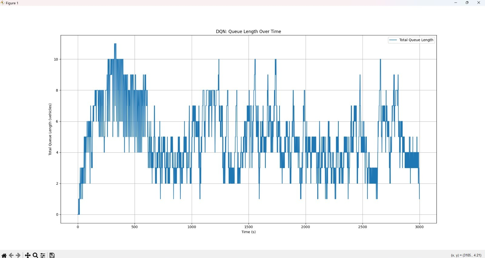
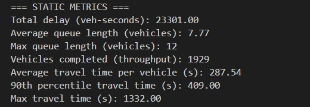
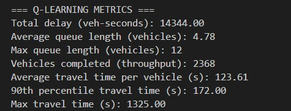
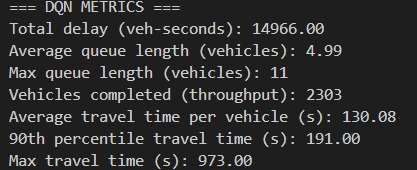
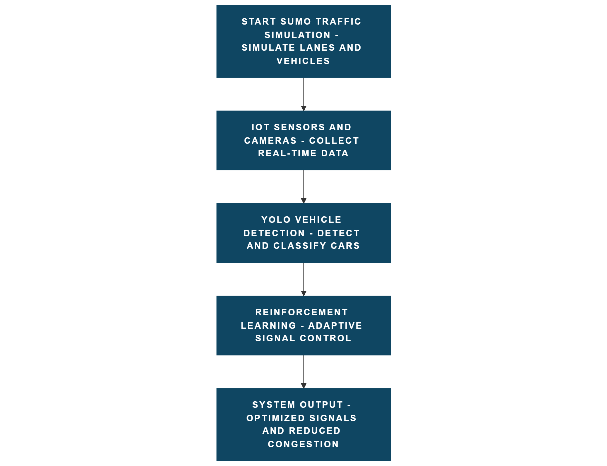
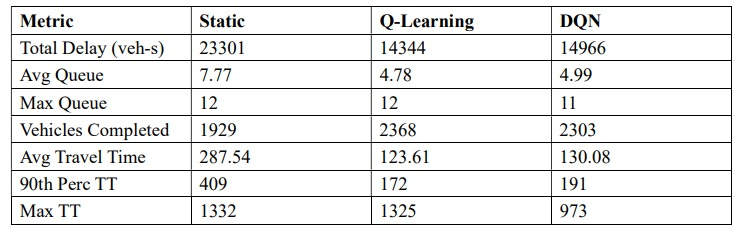

# 🚦 Intelligent Traffic Signal Optimization Using Reinforcement Learning in SUMO

[](https://www.python.org/)
[](https://eclipse.dev/sumo/)
[](https://www.tensorflow.org/)
[](https://opensource.org/licenses/MIT)

**Institution:** Indian Institute of Information Technology, Nagpur (IIITN)  
**Mentor:** Dr. Rashmi Pandhare  
**Contributors:** Saurabh Kumar • Darshan Tate • Sai Chandra Mouli  
**Project Presentation:** [docs/Traffic_Signal_Optimization_Presentation.pdf](docs/Traffic_Signal_Optimization_Presentation.pdf)  
**Technical Reference Guide (PDF):** [docs/Intelligent_Traffic_Signal_Optimization_Guide.pdf](docs/Intelligent_Traffic_Signal_Optimization_Guide.pdf)  

---

## 📌 Executive Summary
Urban traffic congestion at signalized intersections is heavily aggravated by conventional fixed-time controllers that cannot respond dynamically to fluctuating traffic demand. This project develops, benchmarks, and contrasts three traffic signal control strategies within a high-fidelity microscopic simulation environment:

1. **Static / Fixed-Time Controller** (Benchmark Baseline)
2. **Tabular Q-Learning RL Agent** (Discrete State-Action Value Policy)
3. **Deep Q-Network (DQN) RL Agent** (Deep Neural Network Function Approximator)

Powered by Eclipse **SUMO** (Simulation of Urban MObility), real-time control via **TraCI** (Traffic Control Interface), and **E1/E2 induction loop detectors**, the models are systematically evaluated using real-world Intelligent Transportation Systems (**ITS**) performance metrics.

---

## 🧠 Reinforcement Learning System Design

```
                     +---------------------------------------+
                     |            SUMO Simulation            |
                     |  (Microscopic Traffic Environment)    |
                     +-------------------+-------------------+
                                         |
                       Detectors E1/E2 & Signal State
                                         v
                     +---------------------------------------+
                     |         State Vector S in R^7         |
                     | 6 Lane Queue Counts + Current Phase   |
                     +-------------------+-------------------+
                                         |
                                         v
                     +---------------------------------------+
                     |         RL Agent (Q-Table / DQN)      |
                     |        Epsilon-Greedy Policy          |
                     +-------------------+-------------------+
                                         |
                               Action A in {0, 1}
                     (0: Keep Phase, 1: Switch Phase)
                                         v
                     +---------------------------------------+
                     |           TraCI Actuator              |
                     |   Phase Switch (Min-Green Guard >= 5s)|
                     +-------------------+-------------------+
                                         |
                            Reward R = -(Sum of Queues)
                                         v
                     +---------------------------------------+
                     |          Bellman / NN Update          |
                     +---------------------------------------+
```

### 1. State Space ($S \in \mathbb{R}^7$)
A 7-dimensional continuous/discrete state representation capturing queue length from 6 lane detectors plus the current active traffic signal phase index:
- $q_0, q_1, q_2$: Eastbound lanes (`Node1_2_EB_0`, `Node1_2_EB_1`, `Node1_2_EB_2`)
- $q_3, q_4, q_5$: Southbound lanes (`Node2_7_SB_0`, `Node2_7_SB_1`, `Node2_7_SB_2`)
- $\phi$: Current traffic light phase index on junction `Node2`

### 2. Action Space ($A \in \{0, 1\}$)
- **`0`**: Maintain current signal phase (keep green).
- **`1`**: Transition to next phase in cyclic sequence (subject to safety guard `MIN_GREEN_STEPS = 5s`).

### 3. Reward Function
$$R_t = -\sum_{i=0}^{5} \text{Queue}_i(t)$$
Penalizes vehicle backlog across all monitored incoming intersection approaches. Minimizing negative cumulative reward directly minimizes system-wide queue and vehicle delay.

### 4. Mathematical Updates
- **Tabular Q-Learning (Bellman Equation):**
  $$Q(s, a) \leftarrow Q(s, a) + \alpha \left[ R + \gamma \max_{a'} Q(s', a') - Q(s, a) \right]$$
  *(with $\alpha = 0.1$, $\gamma = 0.9$, $\epsilon = 0.1$)*

- **Deep Q-Network (DQN):**
  - **Input Layer:** 7 nodes
  - **Hidden Layer 1:** 24 units, ReLU activation
  - **Hidden Layer 2:** 24 units, ReLU activation
  - **Output Layer:** 2 units, Linear activation ($Q(s, a=0)$, $Q(s, a=1)$)
  - **Optimizer:** Adam ($\text{lr} = 0.001$), Loss: Mean Squared Error (MSE)

---

## 📁 Repository Structure

```
tracii/
├── controllers/                           # Controller implementations
│   ├── __init__.py
│   ├── static_controller.py               # Fixed-time baseline controller
│   ├── q_learning_controller.py           # Tabular Q-Learning RL agent
│   └── dqn_controller.py                  # Deep Q-Network RL agent
├── sumo_config/                           # SUMO network and simulation assets
│   ├── RL.sumocfg                         # Master SUMO configuration
│   ├── RL.net.xml                         # Road network geometry & phases
│   ├── RL.rou.xml                         # Traffic routes and vehicle flows
│   ├── RL.add.xml                         # E1 & E2 lane area detector definitions
│   └── RL.netecfg                        # Netedit configuration file
├── docs/                                  # Project documentation & presentation
│   └── Traffic_Signal_Optimization_Presentation.pdf
├── images/                                # Metric graphs, flowcharts & plots
│   ├── dqn_metrics.jpeg
│   ├── dqn_queue_graph.jpeg
│   ├── q_learning_metrics.jpeg
│   ├── q_learning_queue_graph.jpeg
│   ├── static_metrics.jpeg
│   ├── static_queue_graph.jpeg
│   ├── system_flowchart.png
│   └── conclusion_summary.jpg
├── experiments/                           # Archived previous code iterations
├── outputs/                               # Simulation logs and .npz outputs (.gitignored)
├── Static.py                              # Root runner for Static Controller
├── QL.py                                  # Root runner for Q-Learning Controller
├── DQN.py                                 # Root runner for DQN Controller
├── run_static.py                          # Dedicated launcher
├── run_ql.py                              # Dedicated launcher
├── run_dqn.py                             # Dedicated launcher
├── requirements.txt                       # Project Python dependencies
├── .gitignore                             # Git ignore rules
└── README.md                              # Repository documentation
```

---

## 📊 Comparative Performance Analysis

| Metric | Static Baseline | Tabular Q-Learning | Deep Q-Network (DQN) | RL Improvement over Static |
|:---|:---:|:---:|:---:|:---:|
| **Total Delay (veh-s)** | 23,301 | **14,344** | 14,966 | **38.4% Delay Reduction** |
| **Average Queue Length (veh)** | 7.77 | **4.78** | 4.99 | **38.5% Queue Reduction** |
| **Max Queue Length (veh)** | 12 | 12 | **11** | Best queue peak cap (DQN) |
| **Throughput (Vehicles Cleared)** | 1,929 | **2,368** | 2,303 | **+22.7% Vehicles Cleared** |
| **Average Travel Time (s)** | 287.54 | **123.61** | 130.08 | **57.0% Travel Time Reduction** |
| **90th Percentile Travel Time (s)**| 409.00 | **172.00** | 191.00 | **58.0% Tail Latency Reduction** |
| **Max Travel Time (s)** | 1,332.00 | 1,325.00 | **973.00** | **Best worst-case clearance (DQN)** |

---

## 📈 Visual Graphs & Metric Logs

### 1. Queue Length Over Time

| Static Controller | Q-Learning Controller | DQN Controller |
|:---:|:---:|:---:|
|  |  |  |
| *Queue stays between 7–12 vehicles with frequent spikes.* | *Queue drops into 3–6 range; rapid adaptive clearance.* | *Smooth, stable queue profile (3–5 vehicles).* |

### 2. Time Analysis Terminal Outputs

| Static Metrics Log | Q-Learning Metrics Log | DQN Metrics Log |
|:---:|:---:|:---:|
|  |  |  |

---

## 🔀 System Workflow


---

## 🚀 Quick Start Guide

### 1. Prerequisites & Installation
Ensure you have **Eclipse SUMO** installed and available in your environment:
- Download SUMO: [https://eclipse.dev/sumo/](https://eclipse.dev/sumo/)
- Set `SUMO_HOME` environment variable (e.g. `C:\Program Files (x86)\Eclipse\Sumo`).

Clone the repository and install required Python packages:
```bash
git clone https://github.com/Moulyyy/smart_traffic_controller_v2.git
cd smart_traffic_controller_v2
pip install -r requirements.txt
```

### 2. Running the Controllers

#### Run Static Baseline:
```bash
python Static.py
# or
python controllers/static_controller.py
```

#### Run Tabular Q-Learning:
```bash
python QL.py
# or
python controllers/q_learning_controller.py
```

#### Run Deep Q-Network (DQN):
```bash
python DQN.py
# or
python controllers/dqn_controller.py
```

Simulation results and `.npz` metric arrays are automatically saved to `outputs/`.

---

## 🏁 Key Findings & Conclusion


- **Reinforcement Learning** provides marked gains over fixed-time traffic controllers, reducing total intersection delay by **35–40%** and boosting throughput by **+22%**.
- **Tabular Q-Learning** achieves the highest average efficiency and greatest throughput on isolated 4-way intersections.
- **Deep Q-Network (DQN)** provides superior stability, prevents oscillations, and produces the lowest worst-case travel time (973s vs. 1332s).
- Edge deployment is viable on embedded devices such as NVIDIA Jetson Nano or Raspberry Pi.

---

## 🔮 Future Scope
- Multi-intersection grid coordination via Multi-Agent Reinforcement Learning (MARL).
- Integration with real CCTV feeds using YOLO for real-time detector replacement.
- Emergency vehicle and pedestrian priority actuation.
- Real-world validation with NHAI / municipal traffic telemetry datasets.

---

## 📚 References
1. Wei et al., *"PressLight: Learning Max-Pressure Control for Urban Traffic"*, ACM KDD 2019.
2. Zheng et al., *"IntelliLight: A Reinforcement Learning Approach for Intelligent Traffic Light Control"*, ACM KDD 2019.
3. Van der Pol & Oliehoek, *"Coordinated Deep Reinforcement Learning for Traffic Light Control"*, NeurIPS Workshop 2016.
4. Aslani et al., *"Adaptive Traffic Signal Control Using Deep Reinforcement Learning"*, Expert Systems with Applications, 2022.
5. Lin & Zheng, *"Efficient Deep Reinforcement Learning for Traffic Signal Control"*, IEEE Trans. Vehicular Tech., 2022.
6. Lopez et al., *"Microscopic Traffic Simulation using SUMO"*, IEEE ITSC 2018.
7. Sutton & Barto, *"Reinforcement Learning: An Introduction"*, MIT Press, 2018.

---

## 📜 License
This project is released under the [MIT License](LICENSE).
